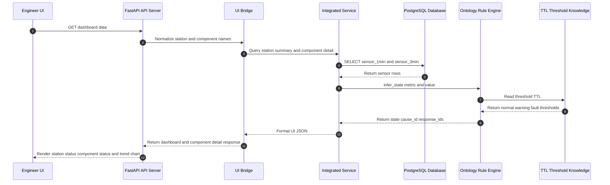
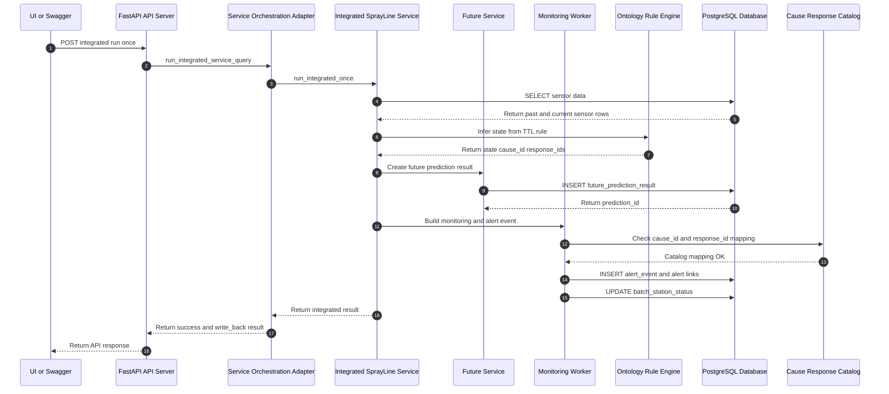
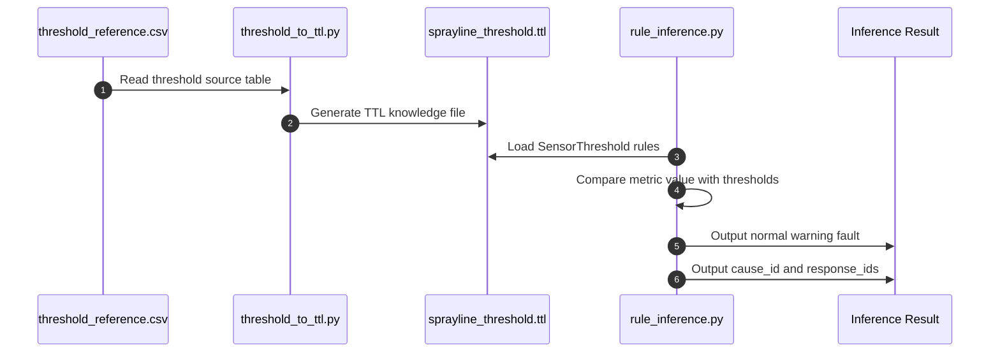

# 0623ver_2 Sequence Diagram：UI / API / DB / Ontology Rule 串接

## 1. UI 查詢 Past / Current / Future 與零件狀態

## 2. Service Orchestration：Future / Monitoring / Alert / DB write-back

## 3. Ontology / TTL / Rule 推論流程

## 4. 報告用說法

這版時序圖主要回應老師逐字稿中「UI 呼叫誰、再呼叫誰、最後誰回傳」的問題。

第一條線是 UI 查詢線。前端透過 dashboard-data、summary、station-detail、component-detail 呼叫 API。API 再透過 UI Bridge 和 Integrated Service 查詢 PostgreSQL 中的 sensor data，並透過 Ontology Rule 讀取 TTL threshold 判斷 normal、warning、fault，最後把整理好的 JSON 回傳給 UI 顯示。

第二條線是 service orchestration 線。透過 integrated run once 呼叫少榆端的 integrated service，執行 future prediction、monitoring、alert event、cause / response mapping，以及 PostgreSQL write-back。

第三條線是 Ontology / TTL / Rule 推論線。threshold_reference.csv 是 threshold 來源檔，threshold_to_ttl.py 會把 CSV 轉成 sprayline_threshold.ttl，rule_inference.py 再讀取 TTL，根據 metric 與 value 判斷 normal、warning、fault，並回傳 cause_id 與 response_ids。
