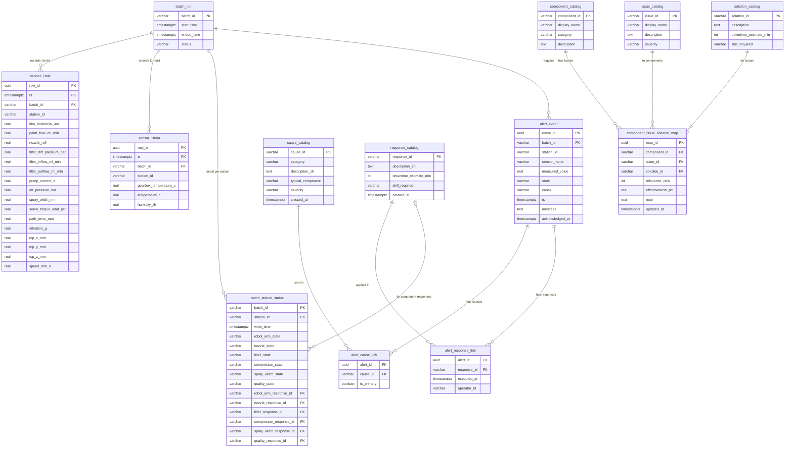

# SprayLine Database ER Model — Schema v6

> 對應設計文件：`sprayline_database_reference_v5.md`
> 引擎：PostgreSQL 16
> 資料表：13 張（含 M:N junction tables）
> 更新日期：2026-06-09
> 主要升版：移除 Zone 1（station_config / sensor_threshold）、Zone 3 拆分為每分鐘/每小時兩張表、Zone 4 重新設計為 batch_station_status、alert_event 欄位重構並加入 M:N cause/response 連結、新增元件問題解方知識庫（Zone 5）

---

## ER Diagram

---

## 資料表結構說明

### Zone 2：批次生產

#### `batch_run`

| 欄位 | 型別 | 說明 |
|---|---|---|
| `batch_id` | `VARCHAR(32)` | PK，格式 `B_YYYYMMDD_NNN` |
| `start_time` | `TIMESTAMPTZ` | 批次開始時間（跨日批次以時間戳記錄） |
| `ended_time` | `TIMESTAMPTZ` | 批次結束時間（`NULL` = 進行中） |
| `status` | `VARCHAR(16)` | `ok` / `warning` / `bad` / `running` |

> v3 移除欄位：`batch_date`、`shift`、`wear_factor`、`updated_at`

---

### Zone 3：感測資料

#### `sensor_1min`（每分鐘，17 個感測欄位）

| 欄位群組 | 欄位 | 說明 |
|---|---|---|
| 識別 | `row_id` UUID、`ts` TIMESTAMPTZ | 複合 PK |
| 識別 | `batch_id` FK、`station_id` VARCHAR | 批次與站點 |
| 品質 | `film_thickness_um` | 膜厚（μm）—— 最終品質 Y 值 |
| 噴嘴 | `paint_flow_ml_min`、`nozzle_roll` | 塗料流量、噴嘴翻滾角 |
| 濾網 | `filter_diff_pressure_bar` | PdM 核心 A：壓差趨勢 |
| 濾網 | `filter_inflow_ml_min`、`filter_outflow_ml_min`、`pump_current_a` | 進出液流量與幫浦電流 |
| 空壓機 | `air_pressure_bar` | 霧化空氣壓力 |
| 噴幅 | `spray_width_mm` | CCD 視覺量測噴幅（mm） |
| 機器手臂 | `servo_torque_load_pct`、`path_error_mm`、`vibration_g` | PdM 核心 B：伺服負載、軌跡誤差、振動 |
| 機器手臂 | `tcp_x_mm`、`tcp_y_mm`、`tcp_z_mm`、`speed_mm_s` | TCP 座標與移動速度 |

#### `sensor_1hour`（每小時，3 個感測欄位）

| 欄位群組 | 欄位 | 說明 |
|---|---|---|
| 識別 | `row_id` UUID、`ts` TIMESTAMPTZ（對齊整點）| 複合 PK |
| 識別 | `batch_id` FK、`station_id` VARCHAR | — |
| 機器手臂熱 | `gearbox_temperature_c` | 減速機溫度（°C），熱慣性大，小時平均足夠 |
| 環境 | `temperature_c`、`humidity_rh` | 環境溫濕度，影響漆料揮發，每小時紀錄即可 |

**每分鐘 vs 每小時分配原則：**

| 面向 | 頻率 | 理由 |
|---|---|---|
| 機器手臂（torque/path/vibration/TCP）| 每分鐘 | PdM 核心，快速劣化需高頻趨勢追蹤 |
| 噴嘴（flow/nozzle_roll） | 每分鐘 | 直接影響品質，需即時監控 |
| 濾網（壓差/流量/幫浦） | 每分鐘 | PdM 核心 A，壓差積累是主要衰退指標 |
| 空壓機（air_pressure） | 每分鐘 | 製程控制，壓力波動直接影響霧化 |
| 噴幅（spray_width） | 每分鐘 | CCD 即時量測，品質關鍵 |
| 品質（film_thickness） | 每分鐘 | 最終品質 Y 值，需即時監控 |
| 機器手臂熱管理（gearbox_temp） | 每小時 | 熱慣性大，小時平均足以反映趨勢 |
| 環境（temp/humidity） | 每小時 | 環境緩慢變化，不需高頻記錄 |

---

### Zone 4：批次站點詳細狀態

#### `batch_station_status`

| 欄位 | 型別 | 說明 |
|---|---|---|
| `batch_id` | `VARCHAR(32)` | PK（組合鍵，FK → `batch_run`）|
| `station_id` | `VARCHAR(32)` | PK（組合鍵，Station_1 / Station_2 / Station_3）|
| `write_time` | `TIMESTAMPTZ` | 本筆寫入時間 |
| `robot_arm_state` | `VARCHAR(8)` | 機器手臂狀態：`ok` / `warning` / `fault` |
| `nozzle_state` | `VARCHAR(8)` | 噴嘴狀態 |
| `filter_state` | `VARCHAR(8)` | 濾網狀態 |
| `compressor_state` | `VARCHAR(8)` | 空壓機狀態 |
| `spray_width_state` | `VARCHAR(8)` | 噴幅狀態 |
| `quality_state` | `VARCHAR(8)` | 品質狀態 |
| `robot_arm_response_id` | `VARCHAR(32)` | FK → `response_catalog`（可 NULL）|
| `nozzle_response_id` | `VARCHAR(32)` | FK → `response_catalog` |
| `filter_response_id` | `VARCHAR(32)` | FK → `response_catalog` |
| `compressor_response_id` | `VARCHAR(32)` | FK → `response_catalog` |
| `spray_width_response_id` | `VARCHAR(32)` | FK → `response_catalog` |
| `quality_response_id` | `VARCHAR(32)` | FK → `response_catalog` |

> v3 移除：`batch_summary`、`pdm_degradation_log`（由本表整合取代）

---

### Alert & Event

#### `alert_event`

| 欄位 | 型別 | 說明 |
|---|---|---|
| `event_id` | `UUID` | PK |
| `batch_id` | `VARCHAR(32)` | FK → `batch_run` |
| `station_id` | `VARCHAR(32)` | 站點識別 |
| `sensor_name` | `VARCHAR(64)` | 觸發警報的感測器名稱 |
| `measured_value` | `REAL` | 觸發時量測值 |
| `state` | `VARCHAR(8)` | `warning` / `fault`（原 `level`）|
| `cause` | `VARCHAR(64)` | 觸發原因標識（原 `event_type`，對應 `cause_catalog.cause_id`）|
| `ts` | `TIMESTAMPTZ` | 事件觸發時間（原 `event_at` + `created_at` 合併）|
| `message` | `TEXT` | 說明文字 |
| `acknowledged_at` | `TIMESTAMPTZ` | 確認時間（`NULL` = 未確認）|

> v3 移除：`rule_id`（Zone 1 已移除）、`resolved_at`

#### `alert_cause_link`（M:N：alert → cause）

| 欄位 | 說明 |
|---|---|
| `alert_id` UUID FK | → `alert_event` |
| `cause_id` VARCHAR FK | → `cause_catalog` |
| `is_primary` BOOLEAN | 是否為主要原因 |

**PK：`(alert_id, cause_id)`**

#### `alert_response_link`（M:N：alert → response）

| 欄位 | 說明 |
|---|---|
| `alert_id` UUID FK | → `alert_event` |
| `response_id` VARCHAR FK | → `response_catalog` |
| `executed_at` TIMESTAMPTZ | 執行時間 |
| `operator_id` VARCHAR(64) | 執行操作員 |

**PK：`(alert_id, response_id)`**

---

### Catalog（原因 & 解方）

#### `cause_catalog`

| 欄位 | 說明 |
|---|---|
| `cause_id` VARCHAR(32) PK | 如 `FILTER_CLOG`、`SERVO_WEAR` |
| `category` VARCHAR(16) | `pdm_core` / `quality_fluid` / `protection` / `environment` / `process` |
| `description_zh` TEXT | 繁體中文說明 |
| `typical_component` VARCHAR(32) | 常見受影響元件 |
| `severity` VARCHAR(8) | `low` / `medium` / `high` |

#### `response_catalog`

| 欄位 | 說明 |
|---|---|
| `response_id` VARCHAR(32) PK | 如 `REPLACE_FILTER`、`RECALIBRATE_TCP` |
| `description_zh` TEXT | 繁體中文說明 |
| `downtime_estimate_min` INT | 預估停機時間（分鐘）|
| `skill_required` VARCHAR(16) | `operator` / `technician` / `engineer` |

---

### Zone 5：元件問題解方知識庫

**設計目的**：提供獨立的診斷知識庫，供操作員查詢、LLM 推薦解方，或作為建立 `batch_station_status.response_id` 的參考依據。與 `alert_cause_link` / `alert_response_link` 的差異：後者記錄**已發生事件**的因果；本區記錄**通用領域知識**（任何元件可能遇到哪些問題、有哪些解方）。

#### `component_catalog`

| component_id | display_name | category |
|---|---|---|
| `ROBOT_ARM` | 機器手臂 | hardware |
| `NOZZLE` | 噴嘴 | hardware |
| `FILTER` | 濾網 | hardware |
| `AIR_COMPRESSOR` | 空壓機 | hardware |
| `SPRAY_WIDTH` | 噴幅 | process_metric |
| `QUALITY` | 品質（膜厚） | process_metric |

#### `issue_catalog`（預置資料範例）

| issue_id | display_name | severity |
|---|---|---|
| `SERVO_OVERLOAD` | 伺服馬達負載過高/磨損 | medium |
| `PATH_ERROR_HIGH` | 軌跡追蹤誤差過大 | high |
| `VIBRATION_HIGH` | 異常振動（碰撞/軸承鬆動） | high |
| `GEARBOX_OVERHEAT` | 減速機過熱 | high |
| `NOZZLE_CLOG` | 噴嘴堵塞（漆渣累積） | high |
| `NOZZLE_WEAR` | 噴嘴孔徑磨損 | medium |
| `FILTER_CLOG` | 濾網堵塞（壓差上升） | medium |
| `FILTER_DAMAGE` | 濾網破損洩漏 | high |
| `AIR_PRESSURE_UNSTABLE` | 空氣壓力不穩/不足 | medium |
| `AIR_MOISTURE_HIGH` | 壓縮空氣含水量過高 | medium |
| `SPRAY_WIDTH_DEVIATION` | 噴幅偏離基準值 | medium |
| `FILM_THICKNESS_OOC` | 膜厚超出規格範圍 | high |

#### `solution_catalog`（預置資料範例）

| solution_id | description | skill_required |
|---|---|---|
| `LUBRICATE_SERVO` | 定期潤滑保養 | technician |
| `REPLACE_SERVO` | 更換伺服馬達/減速機 | engineer |
| `RECALIBRATE_TCP` | 重新校正 TCP（工具中心點） | technician |
| `TIGHTEN_BASE` | 緊固基座螺栓、檢查防震墊 | operator |
| `CLEAN_NOZZLE` | 拆卸清洗噴嘴 | operator |
| `REPLACE_NOZZLE` | 更換磨損噴嘴 | technician |
| `RECALIBRATE_NOZZLE_ANGLE` | 重新校正噴嘴角度 | technician |
| `REPLACE_FILTER` | 更換濾網（依壓差門檻） | operator |
| `BACKWASH_FILTER` | 反洗管路 | technician |
| `INSTALL_DRYER` | 加裝/更換乾燥機與油水分離器 | engineer |
| `DRAIN_CONDENSATE` | 定期排放冷凝水 | operator |
| `CALIBRATE_PRESSURE_VALVE` | 校正壓力調節閥 | technician |
| `ADJUST_TCP_Z` | 校正噴嘴與工件距離（TCP Z） | technician |
| `ADJUST_FLOW_PRESSURE` | 調整塗料流量與空壓比例 | operator |
| `CCD_PATH_CORRECTION` | 啟用 CCD 視覺即時路徑校正 | engineer |
| `ADJUST_SPEED_FLOW` | 調整噴塗速度與流量 | operator |
| `CALIBRATE_ENV_CONTROL` | 校正環境溫濕度控制系統 | engineer |

#### `component_issue_solution_map`（M:N:N 映射範例）

| component_id | issue_id | solution_id | relevance_rank |
|---|---|---|---|
| ROBOT_ARM | SERVO_OVERLOAD | LUBRICATE_SERVO | 1 |
| ROBOT_ARM | SERVO_OVERLOAD | REPLACE_SERVO | 2 |
| ROBOT_ARM | PATH_ERROR_HIGH | RECALIBRATE_TCP | 1 |
| ROBOT_ARM | VIBRATION_HIGH | TIGHTEN_BASE | 1 |
| NOZZLE | NOZZLE_CLOG | CLEAN_NOZZLE | 1 |
| NOZZLE | NOZZLE_WEAR | REPLACE_NOZZLE | 1 |
| FILTER | FILTER_CLOG | REPLACE_FILTER | 1 |
| FILTER | FILTER_CLOG | BACKWASH_FILTER | 2 |
| AIR_COMPRESSOR | AIR_PRESSURE_UNSTABLE | CALIBRATE_PRESSURE_VALVE | 1 |
| AIR_COMPRESSOR | AIR_MOISTURE_HIGH | INSTALL_DRYER | 1 |
| AIR_COMPRESSOR | AIR_MOISTURE_HIGH | DRAIN_CONDENSATE | 2 |
| SPRAY_WIDTH | SPRAY_WIDTH_DEVIATION | ADJUST_TCP_Z | 1 |
| SPRAY_WIDTH | SPRAY_WIDTH_DEVIATION | ADJUST_FLOW_PRESSURE | 2 |
| SPRAY_WIDTH | SPRAY_WIDTH_DEVIATION | REPLACE_NOZZLE | 3 |
| QUALITY | FILM_THICKNESS_OOC | ADJUST_SPEED_FLOW | 1 |
| QUALITY | FILM_THICKNESS_OOC | CALIBRATE_ENV_CONTROL | 2 |

